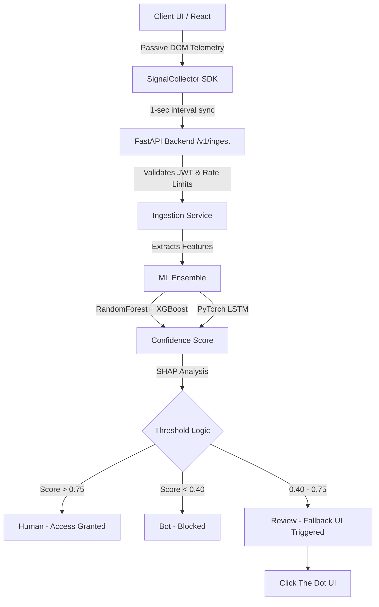

<div align="center">
  <h1>🛡️ PassiveCaptcha</h1>
  <p><b>Frictionless, Machine-Learning Powered Human Verification</b></p>
  <p><i>Building a frictionless web without crosswalks, fire hydrants, and blurry text.</i></p>
  
  
  
  
  
</div>

<hr/>

## 🚨 The Problem
Enterprise digital platforms rely on CAPTCHA to deflect bot traffic and DoS attacks. However, traditional CAPTCHAs create massive friction—frustrating users, ruining onboarding conversion rates, and interrupting seamless digital engagement. Furthermore, modern vision AI and click-farms bypass traditional CAPTCHAs with ease.

## ✨ Our Solution
**PassiveCaptcha** is a completely invisible, ML-based verification system. It passively collects DOM telemetry and behavioral biometrics in the background.

* **High Confidence Human?** Verified instantly. Zero friction.
* **Suspicious/Inconclusive?** Triggers a hyper-lightweight, 1-click "moving dot" fallback challenge.

---

## 🧠 Core Features & Architecture

### 1. Privacy-First Signal Collection
We track math and geometry, **never** PII (Personally Identifiable Information).
* **Behavioral:** Mouse movement linearity, scroll jerk, keystroke rhythms.
* **Environmental:** Browser entropy, device pixel ratios, viewport anomalies, and WebGL rendering signatures.

### 2. Multi-Model ML Ensemble
* **XGBoost & Random Forest:** Analyzes structured browser & environmental features.
* **LSTM Neural Network:** Deep learning model that evaluates sequential mouse trajectories and timing cadence in real time.

### 3. Open Innovation: Explainable AI (XAI)
We didn't just build a black box. PassiveCaptcha utilizes **SHAP (SHapley Additive exPlanations)** values to provide a real-time Analytics Dashboard. Enterprise security admins can see *exactly* which behavioral features pushed a session towards a "Bot" or "Human" verdict.

### 4. Enterprise-Grade Security
Pluggable and production-ready. The system uses **Stateless JWT Session Tokens** and implements strict Redis-backed **Sliding-Window Rate Limiting** to prevent abuse at the edge.

---

## 🏗️ System Architecture



---

## 💻 Tech Stack

**Frontend:**
* React 18 / TypeScript
* Vite / Tailwind CSS
* Headless telemetry SDK

**Backend:**
* Python 3.13 / FastAPI / Uvicorn
* PyJWT (Secure Sessions)
* PyTorch / Scikit-learn / XGBoost (Inference Engine)

---

## 🚀 Getting Started (Run Locally)

### 1. Start the Backend API
Navigate to the backend folder, install ML dependencies, and boot the FastAPI server.
```bash
cd backend
pip install -r requirements-api.txt
python -m uvicorn app.main:app --reload --host 127.0.0.1 --port 8000
```

### 2. Start the Frontend Application
In a new terminal window, navigate to the web app, install Node modules, and boot Vite.
```bash
cd apps/web
npm install
npm run dev
```

### 3. Test the App
Navigate to `http://localhost:5173`. Move your mouse and scroll around naturally to see the ML dashboard classify you as human, or trigger the fallback UI by acting suspiciously!

---

<div align="center">
  <i>Built by Sumit Kumar Das and Piyush Yadav </i>
</div>
